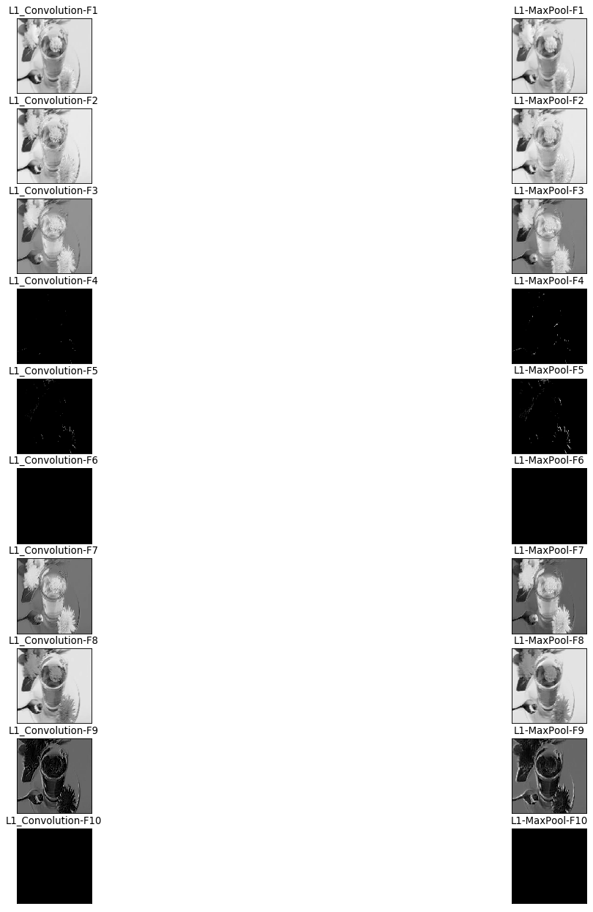

# Convolution Neural Network from Scratch for Coloured Images

Subrat Prasad Panda

Implementation of CNN from Scratch: Classification of Grass vs Dandelion


## 1. Folder Structure:

- `cnn.py` :Implementation of CNN. The Python Notebook file in `.ipynb` is also included.
- `accuracy/`: Folder which stores training and testing results.
	- backup: contains backup of training and testing data.
- `readme.pdf`
- `layer.png`


## 2. Execution:

If executed from the terminal using (.py) file follow:

```console
python3 cnn.py
```

***For the small dataset, training time is around 5 hours. Hence please execute the program wisely.***


Old training and test information will be overwritten. Please check backup folder for old training & testing data if above program is executed while evaluation.

## 3. Training and Testing Results:

All the training and testing results are inluded in the /accuracy/ folder. 

**CNN Model used in Experiment:**

- One Convolution Layer
- ReLu applied
- Maxpool of 2X2 kernel with stride=2
- Softmax layer at the output

Due to humongous training time, the model is only trained for 1 epoch. Also, only single layer of model is used. Increasing the model layers and epoch may further improve the accuracy. Increasing model layers and epoch will add computation time for training. For a small scale experiment the training and testing results are following.

**Training:**

Maximum accuracy achieved while training:  **54%**

**Testing:**

Accuracy on test data after training: **41%**


## 4. Dependencies:

- The `ImageDataGenerator` from `tensorflow` library is used to augment the dataset, hence is not used for building the model.
- The `skimage` and `matplotlib` library is used to visualise the colored images.
- The `numpy` library is used to compute matrix operations.
- The libraries like `os`and rest is used to load the dataset to python environment.

**Illustration of Convolution Layer(with ReLu) after training:**




**References:** The codes are inspired from the following links:

[1] https://github.com/vzhou842/cnn-from-scratch

[2] https://github.com/ahmedfgad/NumPyCNN