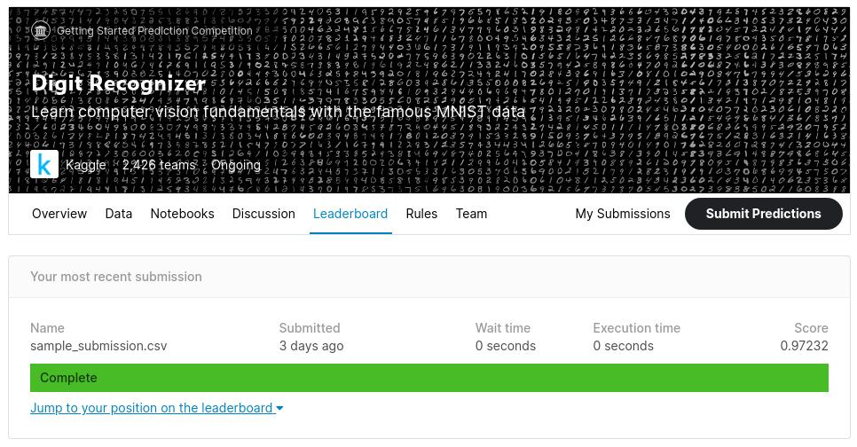

# Multilayer NN


Implemetation of Multi Layer Neural Networks from the scratch.

Training and Testing of model on MNIST and IRIS datasets

*The (.py) file is also included here.*

## 0. Datasets

Please download the MNIST dataset(train.csv, test.csv) from the following link and put it inside `/datasets/` folder:
https://www.kaggle.com/oddrationale/mnist-in-csv?select=mnist_train.csv

For Kaggle, please download following datasets and put it inside the ``/datasets/kaggle/` folder:
https://www.kaggle.com/c/digit-recognizer/data


## 1. Folder Structure:

- `multilayernn.ipynb` :Implementation of Multilayer NN
- ``mnist.ipynb`: Training and Testing of MNIST dataset
- `iris.py`: Training and Testing of IRIS dataset
- `accuracy/`: Folder which stores training and testing results
	- `/mnist/`: results related to mnist
		- `mnistdata_error_train.txt`: Training Data
		- `mnist_error_test.txt`: Testing Data
		- `mnistdata_trainingPlot.pdf`: Plot of the training error vs epoch
	 
	- `/iris/`: results related to mnist
		- `irisdata_error_train.txt`: Training Data
		- `irisdata_error_test.txt`: Testing Data
		- `irisdata_trainingPlot.pdf`: Plot of the training error vs epoch
	- `/backup/`: contains back of `/mnist/` and `/iris/`
- `datasets/`: Folder for all the datasets
- `kaggle_submission/`: The kaggle MNIST sumbission ready `sample_submission.cvs`

## 2. Execution:

If executed from the terminal using (.py) file follow:

```console
python3 iris.py
python3 mnist.py
```
**For MNIST dataset, training time is around 1 hours. Hence please execute the program wisely.**

*IRIS dataet can trained quicly in few seconds*

Old training and test information will be overwritten. Please check backup folder for old training data if above program is executed.

## 3. Training and Testing Results:

All the training and testing results are inluded in the `/accuracy/` folder. Please go to the respective folder to check the training/ testing error and accuracy.

The plots in .pdf format is also available inside the `/accuracy/` folder.


### 3.1 IRIS:

**Training:**

- Accuacy: 98.33333333333333%
- Cross Entropy Error: 0.06866785386882872 
- Trainig PLot: `accuracy/iris/irisdata_trainingPlot.pdf`

**Testing:**

- Accuracy on Test Data: **100%**
- Cross Entropy Error: 0.047570094461726484

### 3.2 MNIST:

**Training:**

- Accuacy: 99.98333333333333%
- Cross Entropy Error: 0.004626357640353235
- Trainig PLot: `accuracy/mnist/mnistdata_trainingPlot.pdf`


**Testing:**

- Accuracy on Test Data: **98.05%**
- Cross Entropy Error: 0.07256237596661355

## 4. Library Information

The library is written from scratch. Following is the code snippet to use the library:

```python
#Create Mulit Layer Network Model
nodes_per_layer = [784, 500, 200, 80, 10] #nodes in each layer of neural network
mnist_nn = deepNN(nodes_per_layer, learning_rate = 0.3, gamma = 0.7, epoch=10)


#Train the model
mnist_nn.train_model(train_data, train_label, train_labels, verbose = True, filename="accuracy/mnist/mnistdata")
#Testing the model
test_error, test_accuracy = mnist_nn.test_model( test_data, test_label, test_labels, filename="accuracy/mnist/mnistdata")
```
	 

## 5. Kaggle Results




> Acknowledgement: Few ideas were taken from [this](https://www.kaggle.com/manzoormahmood/mnist-neural-network-from-scratch)  kaggle notebook where the expalanitions are pretty nice. However, the codes there have some logical errors. 
